---

title: SAAS 业务流程图 (code-review-graph)

generated: 2026-05-24T10:06:42.176837+00:00

source: code-review-graph flows + communities

---

  

# SAAS 全项目业务流程图

  

> 仅由 `code-review-graph` 从代码调用图推导（585 条 execution flows，本文档筛选业务入口流）。

> 打开交互图：`.code-review-graph/graph.html`（社区视图）

  

## 一、七域总览（社区 + 执行流聚合）

  

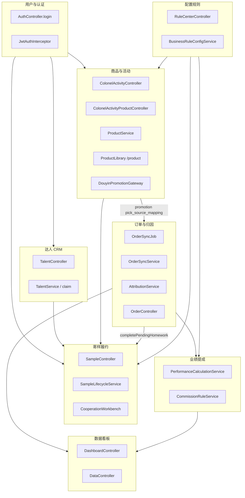

  

## 二、主业务闭环（代码执行流）

  

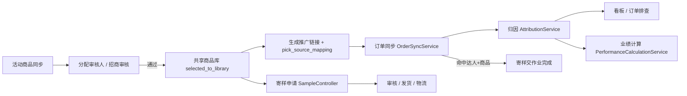

  

## 三、各域 Top 执行流（按 criticality）

  

### 商品域

  

```mermaid

flowchart TD

  subgraph flow0 [Flow #177180 crit=0.86]

    S0_0["fetchProducts"] --> S0_1["getActivityProducts"] --> S0_2["getProductPickPage"] --> S0_3["getProducts"] --> S0_4["notifyApiFailure"] --> S0_5["buildActivityProductInfoQuery"]

  end

  subgraph flow1 [Flow #177181 crit=0.84]

    S1_0["fetchUsers"] --> S1_1["notifyApiFailure"] --> S1_2["loadProductAssigneeOptions"] --> S1_3["handleApiFailure"] --> S1_4["getUserMasterRecruiters"] --> S1_5["applyPermissionHint"]

  end

  subgraph flow2 [Flow #177183 crit=0.83]

    S2_0["loadProductOptions"] --> S2_1["getActivityProducts"] --> S2_2["getProductPickPage"] --> S2_3["getProducts"] --> S2_4["handleApiFailure"] --> S2_5["buildActivityProductInfoQuery"]

  end

  subgraph flow3 [Flow #177185 crit=0.82]

    S3_0["handleSubmit"] --> S3_1["batchAssignActivityProducts"] --> S3_2["notifyApiFailure"] --> S3_3["formatBatchResultMessage"] --> S3_4["normalizeBatchProductIds"] --> S3_5["handleApiFailure"]

  end

  subgraph flow4 [Flow #177187 crit=0.81]

    S4_0["runFullCheck"] --> S4_1["getActivityProducts"] --> S4_2["getMetrics"] --> S4_3["getDouyinActivityProductList"] --> S4_4["getDouyinActivityTest"] --> S4_5["getDouyinInstitutionInfo"]

  end

```

  

| 流 | 入口 | 关键步骤 |

|----|------|----------|

| fetchProducts | fetchProducts | fetchProducts → getActivityProducts → getProductPickPage → getProducts → notifyApiFailure |

| fetchUsers | fetchUsers | fetchUsers → notifyApiFailure → loadProductAssigneeOptions → handleApiFailure → getUserMasterRecruiters |

| loadProductOptions | loadProductOptions | loadProductOptions → getActivityProducts → getProductPickPage → getProducts → handleApiFailure |

| handleSubmit | handleSubmit | handleSubmit → batchAssignActivityProducts → notifyApiFailure → formatBatchResultMessage → normalizeBatchProductIds |

| runFullCheck | runFullCheck | runFullCheck → getActivityProducts → getMetrics → getDouyinActivityProductList → getDouyinActivityTest |

  

### 达人域

  

```mermaid

flowchart TD

  subgraph flow0 [Flow #177196 crit=0.78]

    S0_0["handlePageSizeChange"] --> S0_1["normalizePageSize"] --> S0_2["fetchData"] --> S0_3["getTalentPage"] --> S0_4["notifyApiFailure"] --> S0_5["syncRoute"]

  end

  subgraph flow1 [Flow #177216 crit=0.74]

    S1_0["fetchTalents"] --> S1_1["getTalentPage"] --> S1_2["notifyApiFailure"] --> S1_3["handleApiFailure"] --> S1_4["applyPermissionHint"] --> S1_5["extractRequestErrorMessage"]

  end

  subgraph flow2 [Flow #177238 crit=0.74]

    S2_0["handleSaveShipping"] --> S2_1["updateTalentShippingAddress"] --> S2_2["notifyApiFailure"] --> S2_3["handleApiFailure"] --> S2_4["applyPermissionHint"] --> S2_5["extractRequestErrorMessage"]

  end

  subgraph flow3 [Flow #177256 crit=0.72]

    S3_0["handleSaveTags"] --> S3_1["updateTalentTags"] --> S3_2["notifyApiFailure"] --> S3_3["normalizeTags"] --> S3_4["handleApiFailure"] --> S3_5["applyPermissionHint"]

  end

  subgraph flow4 [Flow #177259 crit=0.72]

    S4_0["handleSearch"] --> S4_1["fetchData"] --> S4_2["getTalentPage"] --> S4_3["notifyApiFailure"] --> S4_4["syncRoute"] --> S4_5["handleApiFailure"]

  end

```

  

| 流 | 入口 | 关键步骤 |

|----|------|----------|

| handlePageSizeChange | handlePageSizeChange | handlePageSizeChange → normalizePageSize → fetchData → getTalentPage → notifyApiFailure |

| fetchTalents | fetchTalents | fetchTalents → getTalentPage → notifyApiFailure → handleApiFailure → applyPermissionHint |

| handleSaveShipping | handleSaveShipping | handleSaveShipping → updateTalentShippingAddress → notifyApiFailure → handleApiFailure → applyPermissionHint |

| handleSaveTags | handleSaveTags | handleSaveTags → updateTalentTags → notifyApiFailure → normalizeTags → handleApiFailure |

| handleSearch | handleSearch | handleSearch → fetchData → getTalentPage → notifyApiFailure → syncRoute |

  

### 寄样域

  

```mermaid

flowchart TD

  subgraph flow0 [Flow #177200 crit=0.77]

    S0_0["fetchChannelOptions"] --> S0_1["notifyApiFailure"] --> S0_2["loadSampleChannelOptions"] --> S0_3["handleApiFailure"] --> S0_4["getUserMasterChannels"] --> S0_5["mapUserOptions"]

  end

  subgraph flow1 [Flow #177201 crit=0.77]

    S1_0["fetchRecruiterOptions"] --> S1_1["notifyApiFailure"] --> S1_2["loadSampleRecruiterOptions"] --> S1_3["handleApiFailure"] --> S1_4["getUserMasterRecruiters"] --> S1_5["mapUserOptions"]

  end

  subgraph flow2 [Flow #177207 crit=0.74]

    S2_0["handleSubmit"] --> S2_1["checkSampleEligibility"] --> S2_2["notifyApiFailure"] --> S2_3["notifyClientPermission"] --> S2_4["handleApiFailure"] --> S2_5["cleanText"]

  end

  subgraph flow3 [Flow #177208 crit=0.74]

    S3_0["handleExport"] --> S3_1["exportSamples"] --> S3_2["notifyApiFailure"] --> S3_3["notifyClientPermission"] --> S3_4["handleApiFailure"] --> S3_5["cleanText"]

  end

  subgraph flow4 [Flow #177217 crit=0.74]

    S4_0["doSubmit"] --> S4_1["createSample"] --> S4_2["notifyApiFailure"] --> S4_3["handleApiFailure"] --> S4_4["applyPermissionHint"] --> S4_5["extractRequestErrorMessage"]

  end

```

  

| 流 | 入口 | 关键步骤 |

|----|------|----------|

| fetchChannelOptions | fetchChannelOptions | fetchChannelOptions → notifyApiFailure → loadSampleChannelOptions → handleApiFailure → getUserMasterChannels |

| fetchRecruiterOptions | fetchRecruiterOptions | fetchRecruiterOptions → notifyApiFailure → loadSampleRecruiterOptions → handleApiFailure → getUserMasterRecruiters |

| handleSubmit | handleSubmit | handleSubmit → checkSampleEligibility → notifyApiFailure → notifyClientPermission → handleApiFailure |

| handleExport | handleExport | handleExport → exportSamples → notifyApiFailure → notifyClientPermission → handleApiFailure |

| doSubmit | doSubmit | doSubmit → createSample → notifyApiFailure → handleApiFailure → applyPermissionHint |

  

### 订单域

  

```mermaid

flowchart TD

  subgraph flow0 [Flow #177179 crit=0.90]

    S0_0["fetchData"] --> S0_1["getOrderPage"] --> S0_2["normalizePageSize"] --> S0_3["notifyApiFailure"] --> S0_4["buildOrderPageParams"] --> S0_5["handleApiFailure"]

  end

  subgraph flow1 [Flow #177184 crit=0.83]

    S1_0["handleExport"] --> S1_1["exportOrders"] --> S1_2["notifyApiFailure"] --> S1_3["notifyClientPermission"] --> S1_4["buildOrderExportParams"] --> S1_5["handleApiFailure"]

  end

  subgraph flow2 [Flow #177187 crit=0.81]

    S2_0["runFullCheck"] --> S2_1["getActivityProducts"] --> S2_2["getMetrics"] --> S2_3["getDouyinActivityProductList"] --> S2_4["getDouyinActivityTest"] --> S2_5["getDouyinInstitutionInfo"]

  end

  subgraph flow3 [Flow #177198 crit=0.77]

    S3_0["fetchChannelOptions"] --> S3_1["notifyApiFailure"] --> S3_2["loadOrderChannelOptions"] --> S3_3["handleApiFailure"] --> S3_4["getUserMasterChannels"] --> S3_5["mapUserOptions"]

  end

  subgraph flow4 [Flow #177199 crit=0.77]

    S4_0["fetchRecruiterOptions"] --> S4_1["notifyApiFailure"] --> S4_2["loadOrderRecruiterOptions"] --> S4_3["handleApiFailure"] --> S4_4["getUserMasterRecruiters"] --> S4_5["mapUserOptions"]

  end

```

  

| 流 | 入口 | 关键步骤 |

|----|------|----------|

| fetchData | fetchData | fetchData → getOrderPage → normalizePageSize → notifyApiFailure → buildOrderPageParams |

| handleExport | handleExport | handleExport → exportOrders → notifyApiFailure → notifyClientPermission → buildOrderExportParams |

| runFullCheck | runFullCheck | runFullCheck → getActivityProducts → getMetrics → getDouyinActivityProductList → getDouyinActivityTest |

| fetchChannelOptions | fetchChannelOptions | fetchChannelOptions → notifyApiFailure → loadOrderChannelOptions → handleApiFailure → getUserMasterChannels |

| fetchRecruiterOptions | fetchRecruiterOptions | fetchRecruiterOptions → notifyApiFailure → loadOrderRecruiterOptions → handleApiFailure → getUserMasterRecruiters |

  

### 业绩域

  

```mermaid

flowchart TD

  subgraph flow0 [Flow #177195 crit=0.78]

    S0_0["loadMetrics"] --> S0_1["getMetrics"] --> S0_2["getPerformanceSummary"] --> S0_3["handleApiFailure"] --> S0_4["applyPermissionHint"] --> S0_5["extractRequestErrorMessage"]

  end

  subgraph flow1 [Flow #177224 crit=0.74]

    S1_0["fetchData"] --> S1_1["getCommissionRulePage"] --> S1_2["notifyApiFailure"] --> S1_3["handleApiFailure"] --> S1_4["applyPermissionHint"] --> S1_5["extractRequestErrorMessage"]

  end

  subgraph flow2 [Flow #177225 crit=0.74]

    S2_0["handleDelete"] --> S2_1["deleteCommissionRule"] --> S2_2["notifyApiFailure"] --> S2_3["handleApiFailure"] --> S2_4["applyPermissionHint"] --> S2_5["extractRequestErrorMessage"]

  end

  subgraph flow3 [Flow #177266 crit=0.71]

    S3_0["handleSubmit"] --> S3_1["createCommissionRule"] --> S3_2["updateCommissionRule"] --> S3_3["notifyApiFailure"] --> S3_4["toIsoString"] --> S3_5["handleApiFailure"]

  end

  subgraph flow4 [Flow #177403 crit=0.48]

    S4_0["chuangjianHuodong"] --> S4_1["getActivityId"] --> S4_2["buildActivityMutateCommand"] --> S4_3["getActivityDesc"] --> S4_4["getActivityName"] --> S4_5["getActivityType"]

  end

```

  

| 流 | 入口 | 关键步骤 |

|----|------|----------|

| loadMetrics | loadMetrics | loadMetrics → getMetrics → getPerformanceSummary → handleApiFailure → applyPermissionHint |

| fetchData | fetchData | fetchData → getCommissionRulePage → notifyApiFailure → handleApiFailure → applyPermissionHint |

| handleDelete | handleDelete | handleDelete → deleteCommissionRule → notifyApiFailure → handleApiFailure → applyPermissionHint |

| handleSubmit | handleSubmit | handleSubmit → createCommissionRule → updateCommissionRule → notifyApiFailure → toIsoString |

| chuangjianHuodong | chuangjianHuodong | chuangjianHuodong → getActivityId → buildActivityMutateCommand → getActivityDesc → getActivityName |

  

### 用户域

  

```mermaid

flowchart TD

  subgraph flow0 [Flow #177192 crit=0.80]

    S0_0["loadMembers"] --> S0_1["getDeptMembers"] --> S0_2["normalizePageSize"] --> S0_3["notifyApiFailure"] --> S0_4["handleApiFailure"] --> S0_5["applyPermissionHint"]

  end

  subgraph flow1 [Flow #177204 crit=0.77]

    S1_0["startDouyinOAuth"] --> S1_1["getDouyinAuthorizeUrl"] --> S1_2["notifyApiFailure"] --> S1_3["unwrap"] --> S1_4["handleApiFailure"] --> S1_5["applyPermissionHint"]

  end

  subgraph flow2 [Flow #177228 crit=0.74]

    S2_0["submitAddMembers"] --> S2_1["addDeptGroupMembers"] --> S2_2["notifyApiFailure"] --> S2_3["handleApiFailure"] --> S2_4["applyPermissionHint"] --> S2_5["extractRequestErrorMessage"]

  end

  subgraph flow3 [Flow #177229 crit=0.74]

    S3_0["removeGroupMember"] --> S3_1["removeDeptGroupMembers"] --> S3_2["notifyApiFailure"] --> S3_3["handleApiFailure"] --> S3_4["applyPermissionHint"] --> S3_5["extractRequestErrorMessage"]

  end

  subgraph flow4 [Flow #177230 crit=0.74]

    S4_0["handleDelete"] --> S4_1["deleteDept"] --> S4_2["notifyApiFailure"] --> S4_3["handleApiFailure"] --> S4_4["applyPermissionHint"] --> S4_5["extractRequestErrorMessage"]

  end

```

  

| 流 | 入口 | 关键步骤 |

|----|------|----------|

| loadMembers | loadMembers | loadMembers → getDeptMembers → normalizePageSize → notifyApiFailure → handleApiFailure |

| startDouyinOAuth | startDouyinOAuth | startDouyinOAuth → getDouyinAuthorizeUrl → notifyApiFailure → unwrap → handleApiFailure |

| submitAddMembers | submitAddMembers | submitAddMembers → addDeptGroupMembers → notifyApiFailure → handleApiFailure → applyPermissionHint |

| removeGroupMember | removeGroupMember | removeGroupMember → removeDeptGroupMembers → notifyApiFailure → handleApiFailure → applyPermissionHint |

| handleDelete | handleDelete | handleDelete → deleteDept → notifyApiFailure → handleApiFailure → applyPermissionHint |

  

### 配置域

  

```mermaid

flowchart TD

  subgraph flow0 [Flow #177226 crit=0.74]

    S0_0["fetchData"] --> S0_1["getConfigPage"] --> S0_2["notifyApiFailure"] --> S0_3["handleApiFailure"] --> S0_4["applyPermissionHint"] --> S0_5["extractRequestErrorMessage"]

  end

  subgraph flow1 [Flow #177227 crit=0.74]

    S1_0["handleDelete"] --> S1_1["deleteConfig"] --> S1_2["notifyApiFailure"] --> S1_3["handleApiFailure"] --> S1_4["applyPermissionHint"] --> S1_5["extractRequestErrorMessage"]

  end

  subgraph flow2 [Flow #177236 crit=0.74]

    S2_0["openChangeLogs"] --> S2_1["getRuleCenterChangeLogs"] --> S2_2["notifyApiFailure"] --> S2_3["handleApiFailure"] --> S2_4["applyPermissionHint"] --> S2_5["extractRequestErrorMessage"]

  end

  subgraph flow3 [Flow #177237 crit=0.74]

    S3_0["loadEventStatus"] --> S3_1["getRuleCenterEventStatus"] --> S3_2["notifyApiFailure"] --> S3_3["handleApiFailure"] --> S3_4["applyPermissionHint"] --> S3_5["extractRequestErrorMessage"]

  end

  subgraph flow4 [Flow #177240 crit=0.73]

    S4_0["openConfirm"] --> S4_1["validateRuleCenter"] --> S4_2["notifyApiFailure"] --> S4_3["buildDiffs"] --> S4_4["collectGroupValues"] --> S4_5["handleApiFailure"]

  end

```

  

| 流 | 入口 | 关键步骤 |

|----|------|----------|

| fetchData | fetchData | fetchData → getConfigPage → notifyApiFailure → handleApiFailure → applyPermissionHint |

| handleDelete | handleDelete | handleDelete → deleteConfig → notifyApiFailure → handleApiFailure → applyPermissionHint |

| openChangeLogs | openChangeLogs | openChangeLogs → getRuleCenterChangeLogs → notifyApiFailure → handleApiFailure → applyPermissionHint |

| loadEventStatus | loadEventStatus | loadEventStatus → getRuleCenterEventStatus → notifyApiFailure → handleApiFailure → applyPermissionHint |

| openConfirm | openConfirm | openConfirm → validateRuleCenter → notifyApiFailure → buildDiffs → collectGroupValues |

  

### 分析域

  

```mermaid

flowchart TD

  subgraph flow0 [Flow #177187 crit=0.81]

    S0_0["runFullCheck"] --> S0_1["getActivityProducts"] --> S0_2["getMetrics"] --> S0_3["getDouyinActivityProductList"] --> S0_4["getDouyinActivityTest"] --> S0_5["getDouyinInstitutionInfo"]

  end

  subgraph flow1 [Flow #177195 crit=0.78]

    S1_0["loadMetrics"] --> S1_1["getMetrics"] --> S1_2["getPerformanceSummary"] --> S1_3["handleApiFailure"] --> S1_4["applyPermissionHint"] --> S1_5["extractRequestErrorMessage"]

  end

  subgraph flow2 [Flow #177211 crit=0.74]

    S2_0["handleExport"] --> S2_1["exportActivities"] --> S2_2["notifyApiFailure"] --> S2_3["handleApiFailure"] --> S2_4["applyPermissionHint"] --> S2_5["extractRequestErrorMessage"]

  end

  subgraph flow3 [Flow #177501 crit=0.40]

    S3_0["getMetrics"] --> S3_1["buildMetrics"] --> S3_2["metricsCacheKey"] --> S3_3["setEstimate"] --> S3_4["setSettle"] --> S3_5["asLong"]

  end

  subgraph flow4 [Flow #177614 crit=0.36]

    S4_0["exportActivities"] --> S4_1["csvEscape"] --> S4_2["getStatus"]

  end

```

  

| 流 | 入口 | 关键步骤 |

|----|------|----------|

| runFullCheck | runFullCheck | runFullCheck → getActivityProducts → getMetrics → getDouyinActivityProductList → getDouyinActivityTest |

| loadMetrics | loadMetrics | loadMetrics → getMetrics → getPerformanceSummary → handleApiFailure → applyPermissionHint |

| handleExport | handleExport | handleExport → exportActivities → notifyApiFailure → handleApiFailure → applyPermissionHint |

| getMetrics | getMetrics | getMetrics → buildMetrics → metricsCacheKey → setEstimate → setSettle |

| exportActivities | exportActivities | exportActivities → csvEscape → getStatus |

  

### 抖店域

  

```mermaid

flowchart TD

  subgraph flow0 [Flow #177187 crit=0.81]

    S0_0["runFullCheck"] --> S0_1["getActivityProducts"] --> S0_2["getMetrics"] --> S0_3["getDouyinActivityProductList"] --> S0_4["getDouyinActivityTest"] --> S0_5["getDouyinInstitutionInfo"]

  end

  subgraph flow1 [Flow #177202 crit=0.77]

    S1_0["checkTokenStatus"] --> S1_1["getDouyinTokenStatus"] --> S1_2["notifyApiFailure"] --> S1_3["unwrap"] --> S1_4["handleApiFailure"] --> S1_5["applyPermissionHint"]

  end

  subgraph flow2 [Flow #177203 crit=0.77]

    S2_0["createToken"] --> S2_1["createDouyinToken"] --> S2_2["notifyApiFailure"] --> S2_3["unwrap"] --> S2_4["handleApiFailure"] --> S2_5["applyPermissionHint"]

  end

  subgraph flow3 [Flow #177204 crit=0.77]

    S3_0["startDouyinOAuth"] --> S3_1["getDouyinAuthorizeUrl"] --> S3_2["notifyApiFailure"] --> S3_3["unwrap"] --> S3_4["handleApiFailure"] --> S3_5["applyPermissionHint"]

  end

  subgraph flow4 [Flow #177205 crit=0.77]

    S4_0["refreshToken"] --> S4_1["refreshDouyinToken"] --> S4_2["notifyApiFailure"] --> S4_3["unwrap"] --> S4_4["handleApiFailure"] --> S4_5["applyPermissionHint"]

  end

```

  

| 流 | 入口 | 关键步骤 |

|----|------|----------|

| runFullCheck | runFullCheck | runFullCheck → getActivityProducts → getMetrics → getDouyinActivityProductList → getDouyinActivityTest |

| checkTokenStatus | checkTokenStatus | checkTokenStatus → getDouyinTokenStatus → notifyApiFailure → unwrap → handleApiFailure |

| createToken | createToken | createToken → createDouyinToken → notifyApiFailure → unwrap → handleApiFailure |

| startDouyinOAuth | startDouyinOAuth | startDouyinOAuth → getDouyinAuthorizeUrl → notifyApiFailure → unwrap → handleApiFailure |

| refreshToken | refreshToken | refreshToken → refreshDouyinToken → notifyApiFailure → unwrap → handleApiFailure |

  

## 四、图谱社区结构（code-review-graph wiki）

  

| 社区 | 规模 | 说明 |

|------|------|------|

| service-id | 3708 | 后端 Service/核心逻辑 |

| service-should | 1919 | 测试 + 断言链 |

| product-handle | 691 | 商品处理 / Controller 邻域 |

| e2e-api | 335 | E2E / API 回归 |

| api-product | 217 | 前端 product API |

| router-menu | 87 | 路由与菜单 |

  

完整社区页：`.code-review-graph/wiki/index.md`

  

## 五、本地查看方式

  

1. **交互式全图**：在浏览器打开 `.code-review-graph/graph.html`

2. **Obsidian 全库**：`.code-review-graph/obsidian/`（8088 页，含节点 wikilink）

3. **重新生成**：

   ```bash

   code-review-graph build

   code-review-graph visualize --mode community

   code-review-graph wiki --force

   python runtime/qa/_crg_business_flows.py

   ```