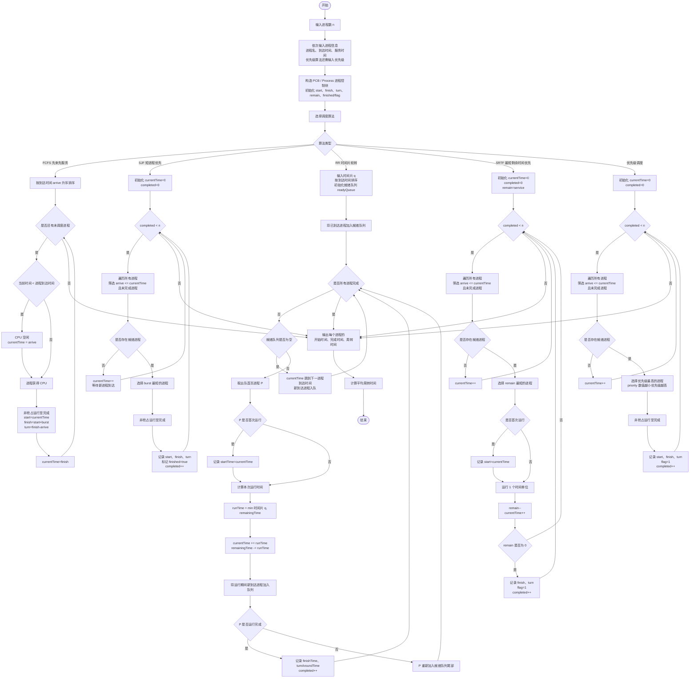

```mermaid
flowchart TD
    A([开始]) --> B[输入进程数 n]
    B --> C[依次输入进程信息<br/>进程名、到达时间、服务时间<br/>优先级算法还需输入优先级]
    C --> D[构造 PCB / Process 进程控制块<br/>初始化 start、finish、turn、remain、finished/flag]
    D --> E[选择调度算法]
    E --> F{算法类型}

    %% FCFS
    F -->|FCFS 先来先服务| FCFS1[按到达时间 arrive 升序排序]
    FCFS1 --> FCFS2{是否还有未调度进程}
    FCFS2 -->|是| FCFS3{当前时间 < 进程到达时间}
    FCFS3 -->|是| FCFS4[CPU 空闲<br/>currentTime = arrive]
    FCFS3 -->|否| FCFS5[进程获得 CPU]
    FCFS4 --> FCFS5
    FCFS5 --> FCFS6[非抢占运行至完成<br/>start=currentTime<br/>finish=start+burst<br/>turn=finish-arrive]
    FCFS6 --> FCFS7[currentTime=finish]
    FCFS7 --> FCFS2
    FCFS2 -->|否| OUT

    %% SJF
    F -->|SJF 短进程优先| SJF1[初始化 currentTime=0<br/>completed=0]
    SJF1 --> SJF2{completed < n}
    SJF2 -->|是| SJF3[遍历所有进程<br/>筛选 arrive <= currentTime 且未完成进程]
    SJF3 --> SJF4{是否存在就绪进程}
    SJF4 -->|否| SJF5[currentTime++<br/>等待新进程到达]
    SJF5 --> SJF2
    SJF4 -->|是| SJF6[选择 burst 最短的进程]
    SJF6 --> SJF7[非抢占运行至完成]
    SJF7 --> SJF8[记录 start、finish、turn<br/>标记 finished=true<br/>completed++]
    SJF8 --> SJF2
    SJF2 -->|否| OUT

    %% RR
    F -->|RR 时间片轮转| RR1[输入时间片 q<br/>按到达时间排序<br/>初始化就绪队列 readyQueue]
    RR1 --> RR2[将已到达进程加入就绪队列]
    RR2 --> RR3{是否所有进程完成}
    RR3 -->|否| RR4{就绪队列是否为空}
    RR4 -->|是| RR5[currentTime 跳到下一进程到达时间<br/>新到达进程入队]
    RR5 --> RR3
    RR4 -->|否| RR6[取出队首页进程 P]
    RR6 --> RR7{P 是否首次运行}
    RR7 -->|是| RR8[记录 startTime=currentTime]
    RR7 -->|否| RR9[计算本次运行时间]
    RR8 --> RR9
    RR9 --> RR10[runTime = min 时间片 q, remainingTime]
    RR10 --> RR11[currentTime += runTime<br/>remainingTime -= runTime]
    RR11 --> RR12[将运行期间新到达进程加入队列]
    RR12 --> RR13{P 是否运行完成}
    RR13 -->|是| RR14[记录 finishTime、turnAroundTime<br/>completed++]
    RR13 -->|否| RR15[P 重新加入就绪队列尾部]
    RR14 --> RR3
    RR15 --> RR3
    RR3 -->|是| OUT

    %% SRTF
    F -->|SRTF 最短剩余时间优先| SRTF1[初始化 currentTime=0<br/>completed=0<br/>remain=service]
    SRTF1 --> SRTF2{completed < n}
    SRTF2 -->|是| SRTF3[遍历所有进程<br/>筛选 arrive <= currentTime 且未完成进程]
    SRTF3 --> SRTF4{是否存在就绪进程}
    SRTF4 -->|否| SRTF5[currentTime++]
    SRTF5 --> SRTF2
    SRTF4 -->|是| SRTF6[选择 remain 最短的进程]
    SRTF6 --> SRTF7{是否首次运行}
    SRTF7 -->|是| SRTF8[记录 start=currentTime]
    SRTF7 -->|否| SRTF9[运行 1 个时间单位]
    SRTF8 --> SRTF9
    SRTF9 --> SRTF10[remain--<br/>currentTime++]
    SRTF10 --> SRTF11{remain 是否为 0}
    SRTF11 -->|是| SRTF12[记录 finish、turn<br/>flag=1<br/>completed++]
    SRTF11 -->|否| SRTF2
    SRTF12 --> SRTF2
    SRTF2 -->|否| OUT

    %% Priority
    F -->|优先级调度| PRI1[初始化 currentTime=0<br/>completed=0]
    PRI1 --> PRI2{completed < n}
    PRI2 -->|是| PRI3[遍历所有进程<br/>筛选 arrive <= currentTime 且未完成进程]
    PRI3 --> PRI4{是否存在就绪进程}
    PRI4 -->|否| PRI5[currentTime++]
    PRI5 --> PRI2
    PRI4 -->|是| PRI6[选择优先级最高的进程<br/>priority 数值越小优先级越高]
    PRI6 --> PRI7[非抢占运行至完成]
    PRI7 --> PRI8[记录 start、finish、turn<br/>flag=1<br/>completed++]
    PRI8 --> PRI2
    PRI2 -->|否| OUT

    OUT[输出每个进程的<br/>开始时间、完成时间、周转时间]
    OUT --> AVG[计算平均周转时间]
    AVG --> END([结束])
```