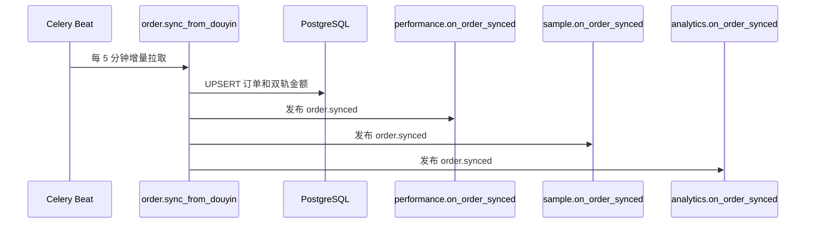

# FastAPI技术落地蓝图

## 概述

新设计文档给出的 V1 工程方案是 FastAPI 模块化单体：一个 monorepo 内分后端、前端、部署脚本和文档，后端按 7 个业务域组织，跨域写副作用通过 Celery + Redis 异步任务承接，读聚合由 BFF 或 Query API 完成。

## 详细内容

### 技术栈口径

| 层级 | V1 选择 | 设计理由 |
|------|---------|----------|
| 后端语言 | Python 3.12+ | 抖音 SDK、爬虫、Excel 处理都更贴近 Python 生态 |
| Web 框架 | FastAPI 0.115+ | 内部 20-50 人规模下足够，开发速度快 |
| ORM / 迁移 | SQLAlchemy 2.x + Alembic | 明确表模型与向前迁移 |
| 队列 | Celery + Redis | 订单同步、爬虫、业绩计算、分析汇总等异步任务 |
| 数据库 | PostgreSQL 15+ | 订单按月分区，支持 JSONB 和复杂筛选 |
| 缓存 | Redis 7.x | Token、配置、限流和任务队列 |
| 前端 | Vue 3 + Vite + Pinia + Naive UI | 管理后台优先流畅、简约、可维护 |
| 部署 | Docker Compose + Nginx + 腾讯云 CVM/TencentDB | 起步简单，dev/prod 分环境 |

这与既有 [[DDD实战-团长SaaS系统/index|DDD实战-团长SaaS系统]] 的 Spring Boot 实战口径不同。建议将本页视为“V1 设计蓝图”，将现有 Java 页面视为“另一套实现复盘”，二者可做对照但不互相覆盖。

### 模块化单体结构

```text
douyin-colonel-saas/
├── backend/
│   ├── app/
│   │   ├── api/v1/
│   │   ├── domains/
│   │   │   ├── product/
│   │   │   ├── talent/
│   │   │   ├── sample/
│   │   │   ├── order/
│   │   │   ├── performance/
│   │   │   ├── user/
│   │   │   └── config/
│   │   ├── analytics/
│   │   ├── integration/
│   │   └── shared/
│   ├── workers/
│   ├── alembic/
│   └── tests/
├── frontend/
├── deploy/
└── docs/
```

单域内部采用 `router.py`、`schemas.py`、`service.py`、`repository.py`、`models.py`、`query.py`、`tasks.py` 的固定结构。关键约束是：本域 repository 只写本域表，不能直接更新其他域表。

### 跨域协作方式

| 场景 | 方式 | 示例 |
|------|------|------|
| 写副作用 | 领域事件映射为 Celery 任务 | 订单入库后发布 `order.synced`，业绩、寄样、分析模块分别消费 |
| 读聚合 | BFF 或 Query API 同步读取 | 订单列表批量补全业绩字段 |
| 配置读取 | 配置域 Query Service + Redis 缓存 | 寄样限制天数、保护期、提成比例 |
| 外部系统 | `integration/` 适配器隔离 | 抖音 API、达人爬虫、物流供应商 |

### 订单同步主链路



V1 的事件实现不引入 Kafka 或 RabbitMQ，而是通过具名 Celery 任务加幂等表 `sys_processed_events` 落地。这样保留事件语义，又控制部署复杂度。

### 数据架构原则

| 原则 | 落地方式 |
|------|----------|
| 业务域隔离 | 表按域前缀组织，如商品、达人、寄样、订单、业绩、用户、配置 |
| 订单高增长 | 订单表按月分区，查询默认近 30 天 |
| 分析独立 | 分析模块维护汇总表，看板读汇总，不扫订单明细 |
| 配置外置 | 天数、门槛、模板、提成比例从配置域读取 |
| 集成隔离 | 抖音 SDK、爬虫、物流都在适配器层封装 |

### 非功能约束

| 约束 | V1 目标 |
|------|---------|
| 列表接口 | 有分页、时间范围和索引时 P95 小于 500ms |
| 订单同步 | 5 分钟同步一次，下游汇总秒级到 30 秒内可见 |
| 前端表格 | 默认 20 条，最大 100 条，筛选防抖 300ms |
| 全表查询 | 禁止无时间范围扫订单全表 |
| 密钥 | 不入库，通过环境变量或云端密钥配置 |
| 可演进性 | V2 独家、物流 API、看板增强通过功能开关和适配器预留 |

### 与现有 Spring Boot 页面可对照的点

| 新设计点 | 可对照页面 |
|----------|------------|
| FastAPI JWT / RBAC / 数据范围 | [[DDD实战-团长SaaS系统/05-认证授权体系|认证授权体系]] |
| Celery 事件消费 | [[DDD实战-团长SaaS系统/18-Webhook事件接收与消费体系|Webhook事件接收与消费体系]] |
| PostgreSQL 分区与表结构 | [[DDD实战-团长SaaS系统/12-数据库架构概览|数据库架构概览]] |
| Vue 3 管理后台 | [[DDD实战-团长SaaS系统/13-前端技术栈与工程结构|前端技术栈与工程结构]] |
| 脚本、QA、部署 | [[DDD实战-团长SaaS系统/20-脚本与QA体系|脚本与QA体系]] |

## 相关概念

- [[DDD实战-团长SaaS系统/21-V1交付范围与业务链|V1交付范围与业务链]]
- [[DDD实战-团长SaaS系统/23-七领域设计总览|七领域设计总览]]
- [[DDD实战-团长SaaS系统/03-本地与三方调用SOP分离|本地与三方调用SOP分离]]
- [[DDD实战-团长SaaS系统/06-抖店开放平台集成|抖店开放平台集成]]
- [[知识库/90-来源与映射/抖音团长SaaS设计文档来源映射|抖音团长SaaS设计文档来源映射]]
