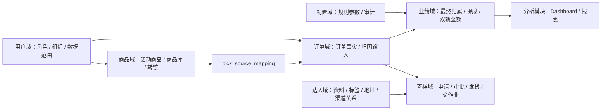

# 当前代码项目接管地图

## 概述

`D:\Projects\SAAS` 当前应作为“抖音团长 SaaS V1 Harness Engineering 项目”理解：它已经不是单纯的 V2.2 需求草案，也不是 FastAPI / Celery 方案，而是以 Spring Boot + Vue 3 + PostgreSQL + Redis + Docker Compose + Playwright 为主的可运行项目。本文只沉淀当前可验证的接管地图，不替代项目内 `AGENTS.md`、`CLAUDE.md` 和 `docs/` 的一手事实。

## 证据链

| 证据来源 | 可观察事实 | 当前推论 |
| --- | --- | --- |
| `README.md` | 项目说明为抖音团长 SaaS，列出 test 与 real-pre 双环境、核心业务能力和启动命令 | 项目已进入可运行交付形态，不是单纯设计文档 |
| `AGENTS.md`、`CLAUDE.md` | 明确采用 Harness Engineering，旧 V2.2、FastAPI、Celery、Python 爬虫只能作历史背景 | 当前知识库必须区分“历史设计来源”和“当前代码事实” |
| `docs/README.md`、`docs/00-10` | 当前事实、V1 范围、领域边界、验收和部署口径已经主干化 | 后续笔记应优先引用主干文档，而不是旧归档 |
| `backend/pom.xml` | Spring Boot 3.2.5、Java 17、MyBatis-Plus、PostgreSQL、Redis、JWT、Knife4j、Testcontainers、JaCoCo | 后端当前技术栈为 Java 模块化单体 |
| `frontend/package.json` | Vue 3、TypeScript、Vite、Naive UI、Pinia、Vue Router、Axios、ECharts、Vitest | 前端当前技术栈为 Vue 3 管理后台 |
| 根目录 `package.json` | Playwright 脚本覆盖 V1 P0、real-pre 预检、real-pre P0、角色回归和视觉回归 | 验收体系已脚本化，不能只写“已完成”而不接证据 |
| code-review-graph | 1043 files、8677 nodes、99347 edges；语言含 Java、Vue、TypeScript、JavaScript、PowerShell、SQL、Python、Bash | 项目规模已经超过单页源码复盘，应以入口地图和证据索引维护 |

## 当前定位

- 当前项目是抖音团长 SaaS 的 V1 交付仓库，目标是支撑渠道、招商、管理、寄样、订单归因、业绩汇总和分析看板的可验证闭环。
- 当前主事实源优先级为：代码与运行配置、`AGENTS.md`、`CLAUDE.md`、`docs/README.md`、`docs/00-10`、领域 / 流程 / 验收 / 决策文档。
- 旧 V2.2 完整方案、旧领域文档、FastAPI、Celery、Python 爬虫式设想属于历史归档或设计背景，不能直接写成当前运行事实。
- real-pre 是当前真实上游 / 生产形态验证环境；test 是 Mock 回归和自动化基线。real-pre 不允许用 mock 数据冒充真实闭环。

## 技术栈地图

| 层级 | 当前事实 | 证据 |
| --- | --- | --- |
| 后端 | Spring Boot 3.2.5 + Java 17 + MyBatis-Plus | `backend/pom.xml` |
| 数据库 | PostgreSQL | `backend/pom.xml`、`docker-compose.*.yml` |
| 缓存 | Redis | `backend/pom.xml`、`docs/10-部署运行总览.md` |
| 第三方 | 抖店 / 抖音 Gateway 封装，SDK 依赖来自项目本地 Maven 仓库 | `backend/lib/maven-repo/`、`README.md` |
| 前端 | Vue 3 + TypeScript + Vite + Naive UI + Pinia | `frontend/package.json` |
| 验收 | Playwright、Vitest、JMeter、runtime QA 脚本 | 根目录 `package.json`、`tests/`、`runtime/qa/` |
| 部署 | Docker Compose test / real-pre 双环境 | `docker-compose.test.yml`、`docker-compose.real-pre.yml`、`docs/10-部署运行总览.md` |

## 目录地图

| 路径 | 作用 | 笔记维护口径 |
| --- | --- | --- |
| `AGENTS.md` | 项目级智能体执行规范和当前阶段地图 | 后续接管任务必须优先读 |
| `CLAUDE.md` | 仓库地图，强调当前事实与历史归档边界 | 用于判断哪些旧资料不能写成事实 |
| `CONTEXT.md` | 统一业务术语和环境术语 | 写笔记时优先采用其中术语 |
| `docs/README.md` | 当前文档地图和阅读顺序 | 项目文档入口 |
| `docs/00-10` | 当前事实、范围、闭环、领域、事件、API、数据、权限、对接、验收、部署 | 正式知识库引用的主干来源 |
| `docs/领域/` | 用户、配置、商品、达人、寄样、订单、业绩、分析模块合同 | 判断模块边界的主依据 |
| `docs/流程/` | 渠道、招商、管理、订单归因、寄样交作业、业绩计算链路 | 判断端到端闭环的主依据 |
| `docs/验收/` | V1 P0、real-pre、E2E、回归脚本和证据索引 | 判断“是否完成”的主依据 |
| `docs/决策/` | ADR，处理 V1 范围、模块化单体、订单 / 业绩 / 分析边界 | 冲突处理入口 |
| `backend/` | Spring Boot 后端 | 代码事实来源 |
| `frontend/` | Vue 3 前端 | 页面与交互事实来源 |
| `runtime/qa/`、`tests/e2e/` | 自动化验收脚本和测试夹具 | 验收证据来源 |
| `.claude/` | AI 工作台：commands、skills、subagents、qa、templates | 项目内智能体流程，不等于业务事实 |

## 领域与业务闭环

当前领域划分以 `docs/03-领域架构总览.md` 为准：

| 领域 | 职责 | 禁止越界 |
| --- | --- | --- |
| 用户域 | 账号、角色、组织、菜单、`self/group/all` 数据范围 | 不计算业务归属 |
| 配置域 | 配置事实、规则参数、配置审计 | 不执行具体业务规则 |
| 商品域 | 活动商品、商品库、转链、`pick_source_mapping` | 不计算提成 |
| 达人域 | 达人资料、标签、地址、跟进、渠道关系 | 不替代订单归属 |
| 寄样域 | 寄样申请、审批、发货、交作业状态 | 不直接判定业绩 |
| 订单域 | 订单事实、退款事实、归因输入、审计日志 | 不算提成、不应用独家覆盖 |
| 业绩域 | 最终归属、提成、冲正、双轨金额计算 | 不采集第三方事实 |
| 分析模块 | 只读汇总、报表、看板 | 不重算业绩归属 |

主业务闭环可以压缩为：

## 运行与验收口径

| 环境 | 用途 | 关键约束 |
| --- | --- | --- |
| test | 本地 mock、P0 回归、权限测试和自动化基线 | 可用 mock / 基线数据，但不得冒充 real-pre |
| real-pre | 真实 SDK、真实上游联调和当前生产形态部署 | `APP_TEST_ENABLED=false`、`DOUYIN_TEST_ENABLED=false`，缺真实样本只能标记 BLOCKED / PENDING |

常用验证入口：

| 命令 | 用途 |
| --- | --- |
| `cd backend; mvn test` | 后端单元 / 集成测试 |
| `cd frontend; npm run build` | 前端构建 |
| `npm run e2e:v1-p0` | test/mock V1 P0 浏览器验收 |
| `npm run e2e:real-pre:p0:preflight` | real-pre 预检 |
| `npm run e2e:real-pre:p0` | real-pre P0 联调验收 |
| `npm run e2e:real-pre:roles` | real-pre 角色与权限回归 |

本次知识库整理没有运行上述测试，因此本文只能作为项目接管地图，不能作为“当前项目通过验收”的证明。

## 代码图谱观察

code-review-graph 当前统计：

| 指标 | 数值 |
| --- | --- |
| 文件数 | 1043 |
| 节点数 | 8677 |
| 边数 | 99347 |
| 主要语言 | Java、Vue、TypeScript、JavaScript、PowerShell、SQL、Python、Bash |
| 主要社区 | `service-talent`、`service-should`、`product-handle`、`api-it:calls`、`e2e-api` |

结构性含义：

- 后端主实现集中在 `backend/src/main/java/com/colonel/saas`，仍以技术分层目录为主。
- 后端测试规模较大，`backend/src/test` 是单独的主要社区。
- 前端视图、API 调用和 E2E 辅助脚本之间耦合度较高，后续改页面时需要同时检查 `frontend/src/views`、`frontend/src/api` 和 `tests/e2e`。
- 代码图谱不能替代测试结果；它只提供结构入口、影响范围和风险提示。

## 维护提醒

- `D:\Projects\SAAS` 当前工作树存在未跟踪文件，包括 `.claude/team-plan-coverage.yaml`、`.opencode/`、`backend/src/main/resources/db/alter-pick-source-mapping-colonel-name.sql`、`docs/11-用户操作手册.md`、`docs/deploy/09-real-pre部署报告-20260528.md`。这些文件可能代表最新工作成果，但在纳入知识库结论前应再次确认是否已定稿。
- 本次未读取 `.env`、`.env.real-pre` 等敏感配置；知识库只引用 `.env.example` 级别的占位信息和文档口径。
- 旧页面 [[DDD实战-团长SaaS系统/24-V1.6骨架与当前项目现状对比|V1.6骨架与当前项目现状对比]] 和 [[DDD实战-团长SaaS系统/25-V1交付范围逐条对照|V1交付范围逐条对照]] 基于 2026-05-18 左右的项目状态。若后续用于排查或验收，应先和当前 `docs/README.md`、`docs/00-10`、代码与测试结果重新对齐。

## 阶段性结论

基于 2026-05-29 的项目扫描，当前最可信的接管结论是：`D:\Projects\SAAS` 已经形成“文档主干 + 代码实现 + 自动化验收 + real-pre 部署证据”的 Harness Engineering 项目。后续知识库维护应把它作为当前代码事实来源，而把 5 月 18 日归档的 `saas系统文件.zip` 作为设计来源和历史对照来源。

## 相关概念

- [[DDD实战-团长SaaS系统/index|DDD实战-团长SaaS系统]]
- [[DDD实战-团长SaaS系统/21-V1交付范围与业务链|V1交付范围与业务链]]
- [[DDD实战-团长SaaS系统/23-七领域设计总览|七领域设计总览]]
- [[DDD实战-团长SaaS系统/24-V1.6骨架与当前项目现状对比|V1.6骨架与当前项目现状对比]]
- [[DDD实战-团长SaaS系统/25-V1交付范围逐条对照|V1交付范围逐条对照]]
- [[知识库/90-来源与映射/抖音团长SaaS当前项目来源映射|抖音团长SaaS当前项目来源映射]]
