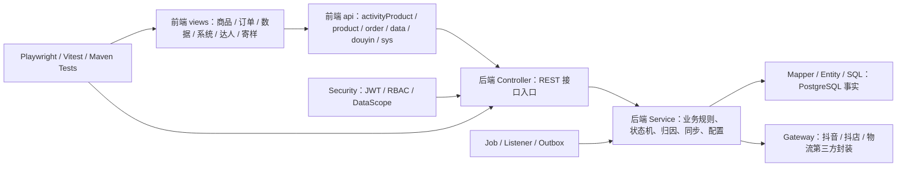

# 代码图谱总览与脉络索引

## 概述

本文基于 `D:\Projects\SAAS` 的 code-review-graph 图谱生成，用于把当前代码库压缩成可导航的工程脉络。它不是源码逐文件清单，也不是验收结论；它回答的是：当前代码从哪些社区组成、哪些链路最关键、后续排查应该先看哪些入口。

## 图谱快照

图谱最后更新：2026-05-29 14:06:35。

| 指标 | 数值 |
| --- | --- |
| 文件数 | 1043 |
| 节点数 | 8677 |
| 边数 | 99347 |
| Class | 876 |
| Function | 4501 |
| Test | 2257 |
| CALLS 边 | 55435 |
| IMPORTS_FROM 边 | 8855 |
| TESTED_BY 边 | 27005 |
| 语言 | Java、Vue、TypeScript、JavaScript、PowerShell、SQL、Python、Bash |

## 代码社区

| 社区 | 规模 | 主语言 | 图谱含义 |
| --- | ---: | --- | --- |
| `service-talent` | 3614 | Java | 后端主实现社区，覆盖 service、controller、mapper、gateway、entity、SQL 等主链路 |
| `service-should` | 2019 | Java | 后端测试社区，覆盖 controller/service/mapper/security/domain event 等测试 |
| `product-handle` | 875 | Vue | 前端视图社区，重点集中在商品、订单、数据、系统、达人、寄样页面 |
| `api-it:calls` | 399 | TypeScript | 前端 API 调用层，连接视图和后端接口 |
| `e2e-api` | 389 | TypeScript | Playwright E2E 与 real-pre 验收脚本社区 |
| `utils-error` | 105 | TypeScript | 前端请求错误处理、分页等工具层 |
| `router-redirect` | 98 | TypeScript | 前端路由、菜单和登录重定向 |
| `helpers-assert` | 49 | TypeScript | E2E helper 与断言封装 |
| `scripts-env` | 18 | Bash | 部署 / 环境脚本小社区 |
| `constants-attribution` | 16 | TypeScript | 订单归因展示文案与前端常量 |

图谱的社区名来自自动聚类，不等同于项目领域名称。后续阅读应以 `docs/03-领域架构总览.md` 的领域边界为业务语义，以图谱社区作为代码导航入口。

## 主干代码脉络

## 关键执行流

| 执行流 | criticality | 节点数 | 起点 | 典型用途 |
| --- | ---: | ---: | --- | --- |
| `fetchProducts` | 0.8567 | 15 | `frontend/src/views/product/index.vue` | 商品页获取活动商品 / 商品库数据，并经过 API 与错误提示工具 |
| `handleExport` | 0.8317 | 15 | `frontend/src/views/data/OrderList.vue` | 订单明细导出，串联导出参数、权限提示和 API |
| `fetchData` | 0.8293 | 14 | 前端数据 / 订单页 | 订单或数据列表查询 |
| `loadMetrics` | 0.8258 | 12 | 数据看板相关页面 | Dashboard / 业绩指标读取 |
| `runFullCheck` | 0.7923 | 22 | `frontend/src/views/ops/DouyinIntegration.vue` | 抖音联调页全量检查，跨商品、订单、指标和抖音 API |
| `doFilterInternal` | 0.7700 | 7 | `JwtAuthenticationFilter` | 后端 JWT 认证过滤链 |
| `checkTokenStatus` | 0.7673 | 11 | `DouyinIntegration.vue` | 抖音 Token 状态检查 |

## 最高影响节点

| 节点 | 图谱信号 | 说明 |
| --- | --- | --- |
| `ProductService` | degree 241 | 后端商品主链路最大热点，涉及商品查询、转链、商品库展示、活动商品视图转换 |
| `ProductService.toActivityProductView` | degree 215 | 活动商品展示转换核心，影响前端商品列表展示 |
| `OrderQueryService.getOrderDetail` | degree 176 | 订单详情聚合路径，影响订单明细和业绩字段展示 |
| `ProductService.generatePromotionLinkInternal` | 202 行 | 转链、`pick_source_mapping`、真实推广写开关相关复杂路径 |
| `AttributionService.resolveAttribution` | 177 行 | 订单归因核心规则路径 |
| `DataApplicationService.getOrderSummary/buildMetrics` | 130/127 行 | 订单统计和 Dashboard 指标构造 |
| `SampleApplicationService.toVO/buildStatusTransitions` | 高连接 + 大函数 | 寄样展示和状态流转矩阵 |
| `JwtAuthenticationFilter.doFilterInternal` | 关键执行流 | 认证、黑名单、401/403 写响应入口 |

## 分层笔记入口

| 页面 | 解决的问题 |
| --- | --- |
| [[DDD实战-团长SaaS系统/29-后端代码图谱脉络|后端代码图谱脉络]] | 后端 Controller、Service、Gateway、Mapper、Security、Job 如何串起来 |
| [[DDD实战-团长SaaS系统/30-前端页面与API图谱脉络|前端页面与API图谱脉络]] | 前端页面、API 模块、路由、错误提示、抖音联调页和商品/订单链路如何串起来 |
| [[DDD实战-团长SaaS系统/31-测试验收与QA图谱脉络|测试验收与QA图谱脉络]] | Maven 测试、Vitest、Playwright、real-pre 脚本和证据链如何串起来 |
| [[DDD实战-团长SaaS系统/32-代码图谱风险与维护清单|代码图谱风险与维护清单]] | 图谱暴露的热点、大函数、桥接测试、耦合点和后续维护问题 |

## 证据边界

- 图谱能证明“代码结构和调用关系”，不能证明“业务验收已经通过”。
- 图谱的 `tests_for` 对 Java 类和前端组件的映射不完全等价于真实测试覆盖率；例如 `AttributionService.resolveAttribution` 有多条测试调用，但类级 `tests_for` 仍可能返回 0。
- E2E 测试在图谱里经常表现为 hub / bridge，这说明它们连接很多页面和 helper，不表示这些测试本身还需要再被测试。
- 本轮没有运行 `mvn test`、`npm run build`、`npm run e2e:*`，因此不能把本文写成验收报告。

## 相关概念

- [[DDD实战-团长SaaS系统/27-当前代码项目接管地图]]
- [[DDD实战-团长SaaS系统/29-后端代码图谱脉络]]
- [[DDD实战-团长SaaS系统/30-前端页面与API图谱脉络]]
- [[DDD实战-团长SaaS系统/31-测试验收与QA图谱脉络]]
- [[DDD实战-团长SaaS系统/32-代码图谱风险与维护清单]]
- [[知识库/90-来源与映射/抖音团长SaaS当前项目来源映射]]
