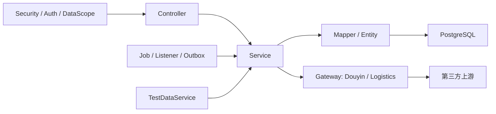
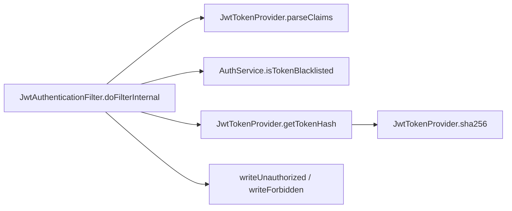

# 后端代码图谱脉络

## 概述

后端代码当前是 Spring Boot 模块化单体，物理目录仍以技术分层为主：`controller`、`service`、`mapper`、`entity`、`gateway`、`security`、`job`、`domain/event`。业务边界不能只从包名判断，必须结合 `docs/领域/` 的合同和图谱中的调用关系一起看。

## 后端目录脉络

| 目录 | 主要职责 | 排查入口 |
| --- | --- | --- |
| `controller/` | REST API 入口，承接前端和 E2E 调用 | 查接口行为、权限入口、请求响应 |
| `service/` | 业务规则、状态机、归因、同步、展示转换、配置读取 | 查根因和业务边界 |
| `mapper/` | MyBatis / MyBatis-Plus 数据访问 | 查 SQL 查询和持久化事实 |
| `entity/`、`dto/`、`vo/` | 数据库实体、请求 DTO、响应 VO | 查字段映射和接口契约 |
| `gateway/`、`douyin/` | 抖音 / 抖店 / 物流第三方封装 | 查真实联调、Token、签名、错误码、test/real 切换 |
| `security/`、`auth/`、`aspect/` | JWT、RBAC、数据范围、角色守卫 | 查 401/403、菜单、数据可见性 |
| `job/`、`listener/`、`domain/event/` | 定时任务、本地事件、Outbox 扩展点 | 查异步、定时、事件消费和幂等 |
| `testsupport/` | 测试造数、seed、reset、test 控制器支撑 | 查 test 环境和 E2E 夹具前置数据 |

## 核心业务链路

## 商品链路

| 图谱入口 | 证据 | 说明 |
| --- | --- | --- |
| `ProductService` | degree 241 | 后端最大热点，覆盖商品库、活动商品、转链、展示转换 |
| `ProductService.generatePromotionLinkInternal` | 202 行，调用 61 个节点 | 转链核心路径，包含快照、`colonelBuyinId` 解析、真实推广链接和映射落库 |
| `ProductService.toActivityProductView` | degree 215，153 行 | 活动商品展示转换，影响前端商品列表和活动商品页 |
| `PickSourceMappingService.saveOrUpdate` | 122 行 | `pick_source_mapping` 写入 / 更新路径，关联订单归因 |
| `ProductQuickSampleService.createSingleSample` | 112 行 | 商品快速寄样入口，连接商品域与寄样域 |

`generatePromotionLinkInternal` 的图谱下游至少包含 `ensureSnapshotExists`、`resolveColonelBuyinIdForNativeMapping` 等内部函数。后续排查“复制简介 / 转链 / pick_source 归因”时，应从 `ProductService`、`PickSourceMappingService`、`RealDouyinPromotionGateway`、`AttributionService` 四处同时取证。

## 订单与归因链路

| 图谱入口 | 证据 | 说明 |
| --- | --- | --- |
| `OrderSyncService.syncItems` | 114 行；调用 50 个节点；调用者为 `syncRange`、`syncSpecificOrders` | 订单同步落库核心处理 |
| `AttributionService.resolveAttribution` | 177 行；调用 29 个节点；有 32 个调用者，其中包含大量单测 | 订单归因核心规则 |
| `OrderQueryService.getOrderDetail` | degree 176；139 行 | 订单详情聚合路径，连接订单事实、寄样信息、归因说明 |
| `OrderController.getStats/getFilterOptions` | 109/96 行 | 订单统计和筛选项接口 |
| `DataApplicationService.getOrderSummary/buildMetrics` | 130/127 行 | 数据模块订单统计和 Dashboard 指标构造 |

归因路径的图谱证据显示：`AttributionService.resolveAttribution` 被 `AttributionServiceTest` 中多个测试直接调用，例如“独家商家优先”“独家达人命中”“跳过独家 owner 使用 pick_source mapping”“无 pick_source 时使用原生团长 Buyin 映射”等分支。类级 `tests_for` 返回 0 不代表完全没有测试，而是图谱的覆盖映射粒度存在限制。

## 寄样链路

| 图谱入口 | 证据 | 说明 |
| --- | --- | --- |
| `SampleApplicationService.toVO` | degree 137 | 寄样响应视图转换热点 |
| `SampleApplicationService.buildStatusTransitions` | 122 行 | 寄样状态流转矩阵 |
| `ProductQuickSampleService.createSingleSample` | 112 行 | 从商品页快速发起寄样 |
| `SampleLogisticsImportService`、`SampleLogisticsSyncService` | 图谱在变更依赖中出现 | 批量物流、物流同步和回调相关 |
| `ManualFallbackLogisticsGateway`、`KdniaoLogisticsGateway`、`Kuaidi100LogisticsGateway` | 图谱增量更新中出现 | test / real-pre 物流底座和 fallback 策略 |

寄样排查不应只看 `SampleController`。如果问题表现为“寄样状态不变”，需要同时确认：寄样状态机、订单同步事件、物流网关返回、`SampleApplicationService` 的 VO 转换、E2E 前置数据。

## 用户、权限与认证链路

| 图谱入口 | 证据 | 说明 |
| --- | --- | --- |
| `JwtAuthenticationFilter.doFilterInternal` | criticality 0.7700，7 个节点 | JWT 认证过滤入口 |
| `AuthService.isTokenBlacklisted` | `doFilterInternal` 下游 | 登出 / 黑名单判断 |
| `JwtTokenProvider.parseClaims/getTokenHash/sha256` | `doFilterInternal` 下游 | Token 解析与哈希 |
| `DataScopeAspect` | 图谱依赖更新中出现 | `self/group/all` 数据范围过滤 |
| `RoleGuardAspect` | 后端测试社区覆盖 | `@RequireRoles` 角色守卫 |
| `SysUserService`、`SysDeptService`、`SysRoleService`、`SysMenuService` | 用户域主服务 | 账号、部门、角色、菜单和组织结构 |

JWT 执行流：

## 第三方 Gateway 链路

| Gateway | 作用 | 排查证据 |
| --- | --- | --- |
| `RealDouyinPromotionGateway` | 真实转链 / 推广写操作 | 真实写开关、Token、上游响应 |
| `RealDouyinProductGateway` | 商品相关真实接口 | 商品同步、活动商品、状态刷新 |
| `RealDouyinActivityGateway` | 活动相关真实接口 | 活动同步和机构活动列表 |
| `RealDouyinTokenGateway`、`DouyinTokenService` | Token 获取、刷新、状态检查 | real-pre 联调、OAuth 回调 |
| `KdniaoLogisticsGateway`、`Kuaidi100LogisticsGateway` | 物流查询 / 订阅 | 物流配置、签名、回调 |
| `TestDouyin*Gateway`、`TestLogisticsGateway` | test 环境替身 | Mock 回归和可复现测试 |

## 高复杂度函数清单

| 函数 | 行数 | 风险含义 |
| --- | ---: | --- |
| `ProductService.generatePromotionLinkInternal` | 202 | 转链、映射、真实写开关、fallback 逻辑集中 |
| `AttributionService.resolveAttribution` | 177 | 归因优先级与多来源匹配集中 |
| `TestDataService.seedAll` | 155 | test 数据基线复杂，E2E 失败时需核对前置数据 |
| `ProductService.toActivityProductView` | 153 | 商品展示字段转换复杂 |
| `OrderQueryService.getOrderDetail` | 139 | 订单详情聚合复杂 |
| `DataApplicationService.getOrderSummary` | 130 | 订单汇总指标复杂 |
| `DataApplicationService.buildMetrics` | 127 | Dashboard 指标计算复杂 |
| `PickSourceMappingService.saveOrUpdate` | 122 | 归因映射写入复杂 |
| `SampleApplicationService.buildStatusTransitions` | 122 | 寄样状态机展示复杂 |
| `OrderSyncService.syncItems` | 114 | 订单同步落库复杂 |

## 后端排查顺序

1. 先读 `docs/领域/` 对应领域合同，确认职责边界。
2. 再从 Controller 找接口入口。
3. 跟到 Service 看业务规则和状态流转。
4. 查 Mapper / SQL 证明数据库事实。
5. 若涉及第三方，查 Gateway 与 real-pre 日志，不直接怀疑前端。
6. 若涉及权限，查 `JwtAuthenticationFilter`、`RoleGuardAspect`、`DataScopeAspect` 和用户/角色/部门数据。
7. 最后用 Maven 单测、Playwright 或 SQL/API 证据验证。

## 相关概念

- [[DDD实战-团长SaaS系统/28-代码图谱总览与脉络索引]]
- [[DDD实战-团长SaaS系统/30-前端页面与API图谱脉络]]
- [[DDD实战-团长SaaS系统/31-测试验收与QA图谱脉络]]
- [[DDD实战-团长SaaS系统/32-代码图谱风险与维护清单]]
- [[DDD实战-团长SaaS系统/27-当前代码项目接管地图]]
