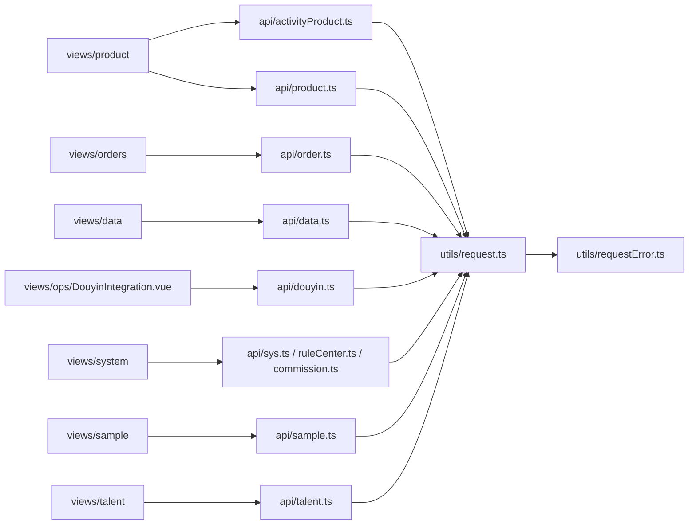

# 前端页面与API图谱脉络

## 概述

前端当前是 Vue 3 + TypeScript + Vite + Naive UI 的管理后台。图谱显示，前端脉络主要由 `views` 页面、`api` 调用层、`utils/requestError.ts` 统一错误处理、`router/menuTree` 菜单路由和 Vitest / Playwright 测试构成。

## 前端结构

| 路径 | 作用 | 图谱观察 |
| --- | --- | --- |
| `frontend/src/views/product/` | 商品、活动商品、商品库、商品详情、快速寄样、操作日志 | `fetchProducts` 是最高 criticality 流 |
| `frontend/src/views/orders/` | 订单列表、订单详情、同步、归因诊断 | 与 `api/order.ts`、`constants/orderAttribution.ts`、错误提示工具耦合 |
| `frontend/src/views/data/` | Dashboard、订单明细、指标、导出 | `handleExport`、`loadMetrics`、`fetchData` 是高频流 |
| `frontend/src/views/ops/` | 抖音联调、独家状态、运营页 | `runFullCheck`、`checkTokenStatus` 集中在抖音联调页 |
| `frontend/src/views/system/` | 用户、角色、部门、配置、规则中心、操作日志 | 权限、组织和配置域页面入口 |
| `frontend/src/views/talent/` | 达人列表、筛选、批量导入、详情 | `useTalentFilters` 是较大 composable |
| `frontend/src/views/sample/` | 寄样申请、详情、工作台、物流导入 | 与商品快速寄样和订单交作业链路相连 |
| `frontend/src/api/` | 后端接口封装 | `api-it:calls` 社区，连接页面与 REST API |
| `frontend/src/utils/` | 请求错误、分页、通用工具 | `utils-error` 社区，是多个页面的共用依赖 |
| `frontend/src/router/` | 路由、菜单和重定向 | `router-redirect` 社区 |

## 页面到 API 的主脉络



## 关键执行流

### 商品页 `fetchProducts`

图谱路径：

```text
frontend/src/views/product/index.vue::fetchProducts
→ frontend/src/api/activityProduct.ts::getActivityProducts
→ frontend/src/api/product.ts::getProductPickPage / getProducts
→ frontend/src/views/product/product-filters.ts::buildActivityProductInfoQuery / buildProductLibraryQueryParams
→ frontend/src/utils/requestError.ts::notifyApiFailure / handleApiFailure
```

含义：

- 商品页不是单一列表请求，而是同时连接活动商品、商品库、筛选参数和统一错误提示。
- 排查商品页异常时，前端侧至少要看 `index.vue`、`activityProduct.ts`、`product.ts`、`product-filters.ts`、`requestError.ts`。
- 后端侧要对照 `ProductController`、`ColonelActivityProductController`、`ProductService`。

### 数据订单导出 `handleExport`

图谱路径：

```text
frontend/src/views/data/OrderList.vue::handleExport
→ frontend/src/api/data.ts::exportOrders
→ frontend/src/views/data/order-list-query.ts::buildOrderExportParams / resolveDateParams
→ frontend/src/utils/requestError.ts::notifyClientPermission / notifyApiFailure
```

含义：

- 导出链路同时有参数构造、权限提示、API 调用和错误提示。
- 如果导出失败，不能只看接口状态码；还要看前端是否正确构造 `timeField`、日期范围和筛选参数。

### 抖音联调页 `checkTokenStatus` / `runFullCheck`

`checkTokenStatus` 路径：

```text
DouyinIntegration.vue::checkTokenStatus
→ api/douyin.ts::getDouyinTokenStatus
→ api/douyin.ts::unwrap
→ utils/requestError.ts::notifyApiFailure
```

`runFullCheck` 路径会横跨：

- `api/activityProduct.ts::getActivityProducts`
- `api/data.ts::getMetrics`
- `api/douyin.ts::getDouyinActivityProductList/getDouyinActivityTest/getDouyinInstitutionInfo/getDouyinTokenStatus/postDouyinRawProbe`
- `api/order.ts::getOrders/syncOrders`
- `views/data/dashboard-metrics.ts`
- `utils/requestError.ts`

含义：

- 抖音联调页是跨域综合探针，不只是一个 Token 页面。
- 它把商品、订单、指标、抖音接口和错误提示聚合在一起，因此适合作为 real-pre 排障入口，但不适合把所有失败都归因到一个模块。

## 前端公共耦合点

| 节点 | 图谱信号 | 维护含义 |
| --- | --- | --- |
| `utils/requestError.ts::notifyApiFailure` | 多个高 criticality flow 都调用 | 错误提示口径一改会影响商品、订单、数据、抖音联调页 |
| `utils/requestError.ts::notifyClientPermission` | 订单导出等权限路径调用 | 403 / 权限提示排查要看这里 |
| `views/product/product-filters.ts` | 商品页高频下游 | 商品筛选字段、后端 query key 和 UI 过滤规则必须同步 |
| `views/data/order-list-query.ts` | 导出与订单列表参数构造 | 列表筛选和导出参数一致性要靠这里 |
| `constants/orderAttribution.ts` | 订单归因原因文案 | 前端展示不能自行发明后端业务原因 |
| `router/menuTree.ts` | 菜单和路由 | 角色菜单、隐藏页、登录后跳转需对照这里 |

## 前端大函数与复杂点

| 函数 | 行数 | 位置 | 风险 |
| --- | ---: | --- | --- |
| `DouyinIntegration.vue::runFullCheck` | 198 | `views/ops` | 跨多个 API 的联调探针，失败原因需要拆分定位 |
| `useTalentFilters` | 112 | `views/talent/composables` | 达人筛选参数映射较集中 |
| `product/index.vue::fetchProducts` | 95 | `views/product` | 商品页数据加载入口复杂 |

## 前端排查顺序

1. 先看页面入口：`views/*`。
2. 查 `api/*` 是否调用正确内部接口。
3. 查请求参数构造工具，如 `product-filters.ts`、`order-list-query.ts`。
4. 查 `utils/request.ts`、`utils/requestError.ts` 处理是否吞掉或重写错误。
5. 查路由和菜单：`router/index.ts`、`router/menuTree.ts`。
6. 回到后端 Controller / Service / Gateway 查真实响应。
7. 用 Vitest 或 Playwright 证据证明修复，不用页面肉眼判断替代验收。

## 相关概念

- [[DDD实战-团长SaaS系统/28-代码图谱总览与脉络索引]]
- [[DDD实战-团长SaaS系统/29-后端代码图谱脉络]]
- [[DDD实战-团长SaaS系统/31-测试验收与QA图谱脉络]]
- [[DDD实战-团长SaaS系统/32-代码图谱风险与维护清单]]
- [[DDD实战-团长SaaS系统/13-前端技术栈与工程结构]]
