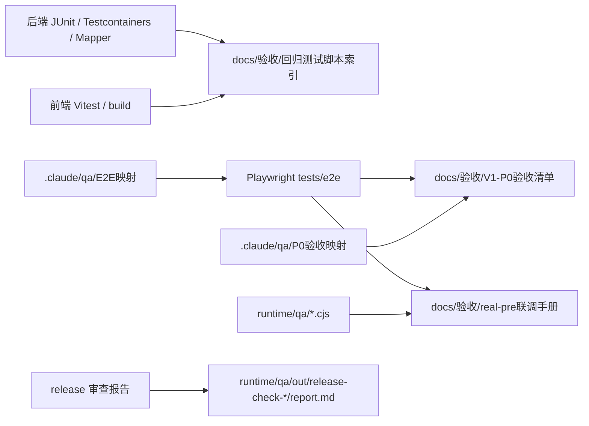

# 测试验收与QA图谱脉络

## 概述

本文把 `D:\Projects\SAAS` 的测试与 QA 体系整理成可排查的证据地图。它只说明测试入口、覆盖脉络和证据路径，不声明当前所有测试已经通过；是否通过必须以实际命令输出、报告、API / SQL / 日志证据为准。

## 测试资产快照

| 资产 | 当前扫描数量 | 用途 |
| --- | ---: | --- |
| `backend/src/test/**/*.java` | 205 | 后端单元 / 集成 / mapper / controller / service 测试 |
| `frontend/src/**/*.test.ts`、`*.spec.ts` | 60 | 前端 Vitest 组件、工具和页面逻辑测试 |
| `tests/e2e/**/*.spec.ts` | 39 | 根目录 Playwright E2E、V1 P0、real-pre、权限、视觉链路 |
| `runtime/qa/**/*.cjs` | 67 | QA 编排脚本、real-pre 预检、业务流、可见性和清理脚本 |

这些数量来自文件扫描，不等于测试通过数量。

## 验收入口

| 命令 | 验证范围 | 证据边界 |
| --- | --- | --- |
| `cd backend; mvn test` | 后端单元 / 集成测试 | 证明 Java 代码和数据库相关测试，不证明页面体验 |
| `cd frontend; npm run test` | 前端 Vitest | 证明前端逻辑和组件测试，不证明真实浏览器全链路 |
| `cd frontend; npm run build` | 前端构建 | 证明前端可构建，不证明接口链路 |
| `npm run e2e:v1-p0` | test/mock V1 P0 浏览器验收 | 只能证明 test 基线，不替代 real-pre |
| `npm run e2e:real-pre:p0:preflight` | real-pre 预检 | 证明环境前置条件，不等于业务闭环通过 |
| `npm run e2e:real-pre:p0` | real-pre P0 联调验收 | 必须结合真实 Token、真实接口响应和日志 |
| `npm run e2e:real-pre:roles` | real-pre 角色权限回归 | 验证菜单、权限和数据范围 |

## 图谱中的 QA 信号

code-review-graph 显示，最高 hub / bridge 节点里有多条 E2E 测试：

| 图谱节点 | 信号 | 维护含义 |
| --- | --- | --- |
| `11-real-pre-role-business-flow.spec.ts` | total degree 467，betweenness 0.016484 | 角色、菜单、权限、交接路径的高连接验收入口 |
| `09-full-user-journey.spec.ts` | total degree 283 | 管理员完整用户旅程入口 |
| `33-real-pre-sample-chain.spec.ts` | total degree 228，betweenness 0.011478 | 寄样链路 real-pre P0 关键桥接测试 |
| `10-real-pre-business-flow.spec.ts` | total degree 224 | 推广映射复用、业务流和 Dashboard 可读性入口 |
| `23-v1-rbac-scope.spec.ts` | 多个 401/403 / 数据范围 bridge | 权限边界和未授权访问回归入口 |

这些 E2E 在图谱中很“重”，说明它们连接很多页面、helper、API 和业务步骤。修改 helper、认证、角色菜单、数据范围、寄样或 real-pre 环境时，应优先检查这些测试是否受影响。

## QA 分层地图

## 排查顺序

1. 先确认问题属于后端、前端、E2E、real-pre 环境还是第三方上游。
2. 查 `docs/09-测试验收总览.md` 和 `docs/验收/`，确认该项应由哪个脚本或证据证明。
3. 若是页面问题，先跑或定位对应 Playwright spec，再回到 `frontend/src/views` 与 `frontend/src/api`。
4. 若是接口或数据问题，先跑后端相关测试，再查 Controller、Service、Mapper、SQL。
5. 若是 real-pre 问题，必须收集真实配置状态、后端日志、上游响应、QA 报告，不用 test/mock 结果替代。

## 证据边界

- 2026-05-28 release 报告记录过 `mvn test`、前端测试、构建和审计 PASS，但本页未重新执行这些命令。
- `test/mock` 的 PASS 不能证明 `real-pre` 真实上游闭环。
- E2E 脚本存在不等于业务验收已通过；必须有本次运行报告或日志。

## 相关概念

- [[DDD实战-团长SaaS系统/28-代码图谱总览与脉络索引]]
- [[DDD实战-团长SaaS系统/32-代码图谱风险与维护清单]]
- [[DDD实战-团长SaaS系统/47-测试验收总览]]
- [[DDD实战-团长SaaS系统/49-real-pre上线前总审查与受控部署]]
- [[抖店团长SaaS-技术体系/06-测试验收|测试验收]]
