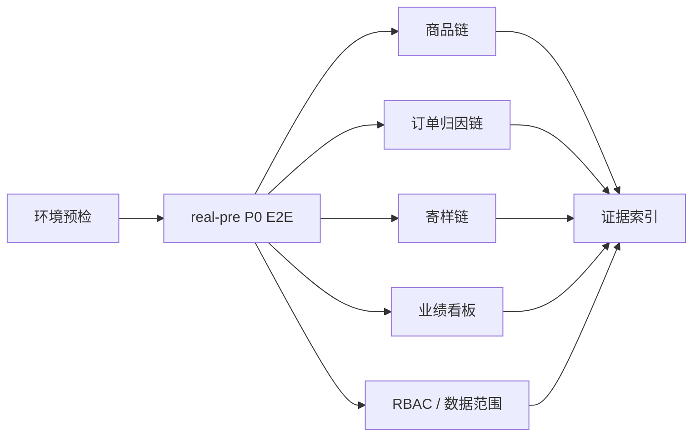

# 测试验收与QA图谱脉络

## 概述

测试验收代码是当前项目的重要代码脉络之一。图谱显示，E2E / real-pre 测试不仅是“测试文件”，还是跨页面、API、角色、数据和证据目录的桥接层。因此后续判断“功能是否完成”时，必须回到测试脚本、SQL/API 证据和项目内验收文档，而不是只看代码是否存在。

## 测试层级

| 层级 | 路径 / 命令 | 用途 |
| --- | --- | --- |
| 后端单元 / 集成测试 | `backend/src/test/java`、`cd backend; mvn test` | service、controller、mapper、security、domain event 回归 |
| 前端单元测试 | `frontend/src/**/*.test.ts`、`npm --prefix frontend run test` | API 封装、组件显示、筛选参数、工具函数 |
| Playwright E2E | `tests/e2e/`、`npm run e2e:*` | 页面级、角色级、业务链路级验收 |
| runtime QA | `runtime/qa/*.cjs`、`scripts/qa/*.ps1` | real-pre、可见浏览器、环境预检、业务巡检 |
| JMeter | `tests/jmeter/` | 性能 / 接口批量压测入口 |
| 项目验收文档 | `docs/09-测试验收总览.md`、`docs/验收/` | 测试命令、证据路径和状态口径 |

## E2E 图谱热点

| 节点 | 图谱信号 | 含义 |
| --- | --- | --- |
| `tests/e2e/11-real-pre-role-business-flow.spec.ts` | hub degree 467；bridge betweenness 最高 | 角色菜单、权限、业务交接的综合验收脚本 |
| `tests/e2e/09-full-user-journey.spec.ts` | hub degree 283 | 管理员全功能巡检 |
| `tests/e2e/33-real-pre-sample-chain.spec.ts` | bridge 节点，betweenness 0.009285 | real-pre 寄样链核心验收 |
| `tests/e2e/10-real-pre-business-flow.spec.ts` | hub degree 224 | 推广映射、Dashboard 可读性等 real-pre 业务流 |
| `tests/e2e/31-real-pre-product-chain.spec.ts` | hub degree 164 | real-pre 商品链 |
| `tests/e2e/32-real-pre-order-attribution.spec.ts` | hub degree 138 | real-pre 订单同步与归因 |
| `tests/e2e/36-real-pre-cleanup-plan.spec.ts` | bridge 节点 | 清理计划和部署后收口相关 |

这些测试在图谱中表现为 hub / bridge，不表示它们还要被“测试的测试”覆盖，而是说明它们承载了大量跨模块验收语义。维护时应保证脚本可读、证据路径明确、失败状态能定位到模块。

## 后端测试脉络

| 领域 / 模块 | 典型测试入口 | 图谱观察 |
| --- | --- | --- |
| 归因 | `AttributionServiceTest` | `resolveAttribution` 有多个测试调用，覆盖独家商家、独家达人、pick_source mapping、原生 Buyin 映射等分支 |
| 订单同步 | `OrderSyncServiceTest`、`TestDataServiceTest` | `OrderSyncService` 类级 `tests_for` 能映射到 `syncTestOrdersDelegatesToOrderSyncService` |
| 权限 | `RoleGuardAspectTest`、`JwtAuthenticationFilterTest`、`JwtTokenProviderTest`、`SecurityConfigTest` | 401/403、角色守卫、Token 解析和黑名单相关 |
| 用户 / 组织 | `SysUserServiceTest`、`SysDeptServiceTest`、`SysRoleServiceTest`、`SysMenuServiceTest` | 用户域、组织结构、菜单和角色 |
| 商品 | `ProductServiceTest`、`ProductControllerTest`、`ColonelActivityProductControllerTest` | 图谱类级覆盖映射不完整，仍需实际看测试文件和 `mvn test` |
| 寄样 | `SampleControllerTest`、`SampleEligibilityServiceTest`、`SampleLogisticsSyncServiceTest` | 寄样状态、资格、物流和展示 |
| 物流 | `Kuaidi100LogisticsGatewayTest`、`KdniaoLogisticsGatewayTest`、`ManualFallbackLogisticsGatewayTest` | 真实 / fallback 物流接口底座 |

## 前端测试脉络

| 模块 | 典型测试 |
| --- | --- |
| 商品筛选与展示 | `product-filters.test.ts`、`product-library-display.test.ts`、`product-operation-log-display.test.ts` |
| 商品复制简介 | `product-copy.test.ts` |
| 商品组件 | `ProductCard.test.ts`、`QuickSampleModal.test.ts`、`ProductSpecSelector.test.ts` |
| 订单与数据 | `OrderList.test.ts`、`order-list-query.test.ts`、`dashboard-metrics.test.ts` |
| 订单筛选候选人 | `order-user-filter-options.test.ts` |
| 达人筛选 | `useTalentFilters.test.ts` |
| 路由菜单 | `router/index.test.ts`、`menuTree.test.ts` |
| 请求错误 / API | `utils/request.test.ts`、`api/*.test.ts` |

## real-pre 验收脉络

常用命令：

| 命令 | 用途 |
| --- | --- |
| `npm run e2e:v1-p0` | test/mock V1 P0 浏览器验收 |
| `npm run e2e:real-pre:p0:preflight` | real-pre 预检 |
| `npm run e2e:real-pre:p0` | real-pre P0 联调验收 |
| `npm run e2e:real-pre:roles` | real-pre 角色和数据范围回归 |
| `npm run e2e:real-pre:journey:visual` | real-pre 全链路可视化旅程 |
| `npm run test:all` | 前端 / E2E 聚合测试入口 |

## 测试证据边界

- `PASS` 必须对应脚本、SQL/API 或证据路径。
- `test/mock` 证据只能证明本地闭环，不能替代 real-pre。
- real-pre 缺 Token、缺授权、缺真实订单、缺 `pick_source` 样本时，只能标记 `BLOCKED` 或 `PENDING`。
- 图谱中的 `tests_for=0` 不能直接断言“没有测试”，需要结合测试文件、调用关系和实际测试运行结果。
- 本次只整理图谱，没有运行测试，因此不能更新任何“通过率”结论。

## 相关概念

- [[DDD实战-团长SaaS系统/28-代码图谱总览与脉络索引]]
- [[DDD实战-团长SaaS系统/29-后端代码图谱脉络]]
- [[DDD实战-团长SaaS系统/30-前端页面与API图谱脉络]]
- [[DDD实战-团长SaaS系统/32-代码图谱风险与维护清单]]
- [[DDD实战-团长SaaS系统/20-脚本与QA体系]]
